# [SLIDING PUZZLE](https://theresaabl.github.io/sliding-puzzle)

This website provides a classic sliding puzzle game. The game is played on a square grid with numbered tiles, where the goal is to order the numbers in ascending order with the empty tile in the bottom right corner. The user can chose between many different puzzle sizes. Additionally, a score is saved to provide a leaderboard, such that the user can try and beat their previous records.

Please view the live site here - [Sliding Puzzle](https://theresaabl.github.io/sliding-puzzle)

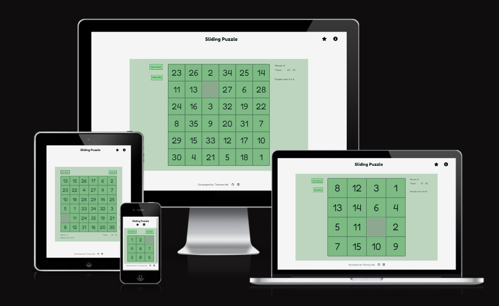

source: [amiresponsive](https://ui.dev/amiresponsive?url=https://theresaabl.github.io/sliding-puzzle)

## User Experience - UX

### Target Audience

This game is designed for anyone who wants to play a simple but demanding single-player game. It is aimed to be appealing to people who like more quiet and peaceful games that require some patience and problem-solving skills. This could be people of any background, age or technical affinity, accessing the site from any device.

### User Stories

- As a user I want to play a sliding puzzle game that is functional and easy to control.
- As a user I want to choose the puzzle size I play on.
- As a user I want to be able to reshuffle the puzzle at any time.
- As a user I want to be able to start a new game at any time.
- As a user I want to see when I won the game and start a new one right away.
- As a user I want to have access to information about the game and the controls.
- As a user I want to see my score and have access to a leaderboard.

### Colour Scheme

I used [coolors.co](https://coolors.co/0d1b1e-f5f5f5-77ad78-8fd694-7dba84-6f8f72) to generate my colour palette.

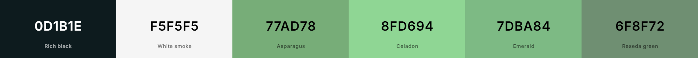

The following colors are used on the site:

- #f5f5f5 as background color
- #0D1B1E for text, borders and icons
- #77ad78 for the game area and some highlights in dialog modals
- #8FD694 for buttons
- #7DBA84 for the puzzle tiles
- #6F8F72 for the background of the puzzle, i.e. the empty tile

The green color scheme was chosen to give the site a calm and relaxed feel, since this game might often be played to relax and get a break from a busy day.

### Typography

- [Fredoka]( https://fonts.google.com/specimen/Fredoka) was used for all text on the page, including the numbers on the puzzle tiles. This font was used because it looks very playful, which fits with the theme of the sliding puzzle game. However, it is still clean and very readable. It has a fall-back font of sans-serif.

- [Font Awesome](https://fontawesome.com) icons were used throughout the site, such as the leaderboard and info icons in the header and the social media icons in the footer.

## Wireframes

To follow best practice, wireframes were developed for mobile (including tablets) and desktop sizes.
I have used [Balsamiq](https://balsamiq.com/wireframes) to design my site wireframes. Note that there is only one wireframe per size, since the game is a one page website and the design choices for the error page follow easily. This project was developed using a mobile first approach.

| Mobile Wireframe | Desktop Wireframe |
| --- | --- |
| 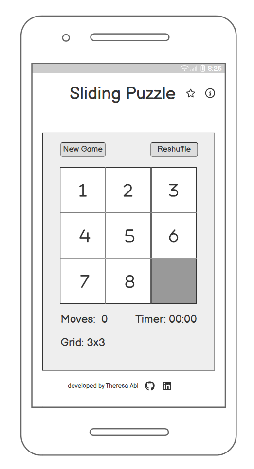 | 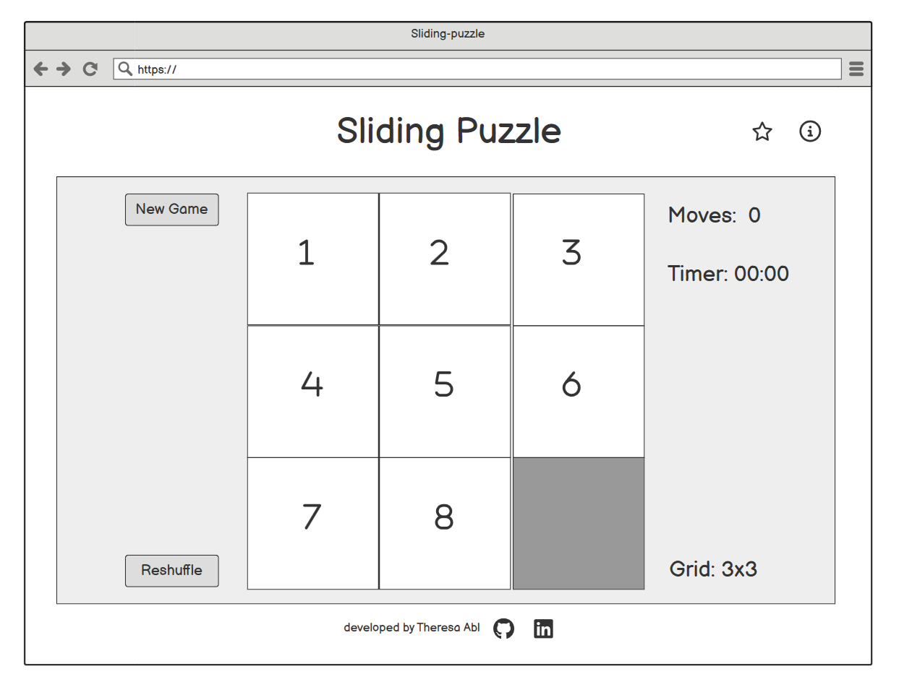 | 

## Features

### Existing Features

| Feature | Description | Screenshot |
| --- | --- | --- |
| [**Logo**] | The logo appears in the header in fixed position. The goal is for the user to know the site purpose at first sight. It has a playful but very readable look which fits the theme of a sliding puzzle game. Clicking the logo links back to the home page. |  |
| Header icons | Below the logo a star icon and an information icon are shown. Clicking on the star icon opens the leaderboard pop up and clicking on the info icon opens the rules pop up (see below). |  |
| Header icons for desktop devices | The icons appear on the right end of the header and have the same functionality as above. |  |
| Game area | The game area indicates the area where the puzzle game is played. It presents the puzzle itself together with the game buttons and the move counter, timer and puzzle size display on a green background. The user should see on first sight which parts of the site contain the actual game and which parts contain additional information or features. |  |
| Game area for desktop devices | The game area has a slightly different layout on larger devices to maximise the size of the square containing the puzzle. |  |
| Sliding puzzle game | The main feature of this site is the sliding puzzle itself. A number of tiles are contained in a square, where the tiles are numbered and the font size scales nicely depending on the number of tiles as well as the screen size. Many different puzzle sizes (number of tiles) are available, where the size can be chosen by the user through input in different pop ups (see below). When clicking on a tile next to the empty tile, the tile moves and so all the tiles can be ordered into ascending order with the empty tile in the bottom right corner. Once the puzzle is ordered a win message will show (see below). | 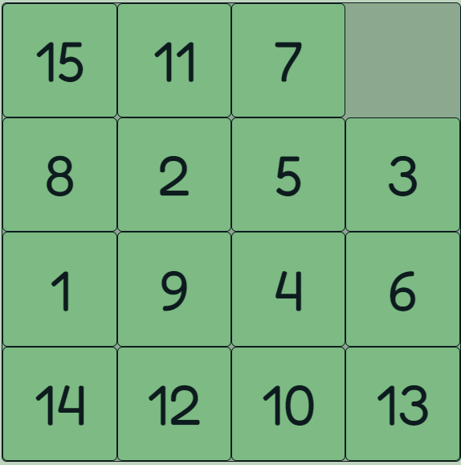 |
| Different puzzle sizes | On the live site puzzle sizes between 2 x 2 and 9 x 9 tiles are available. The maximum available puzzle size can be quickly changed by changing a single variable in the beginning of the [script.js](assets/js/script.js) file. | 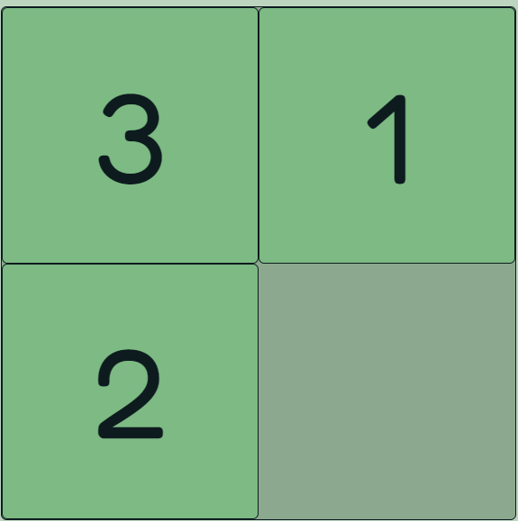   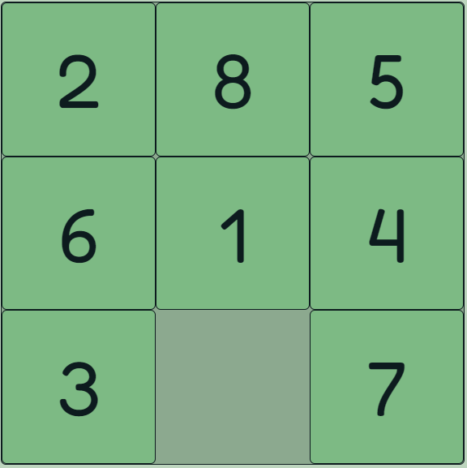  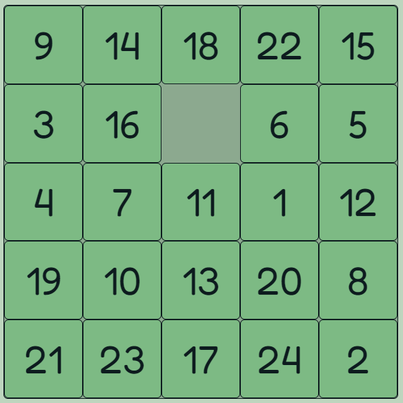 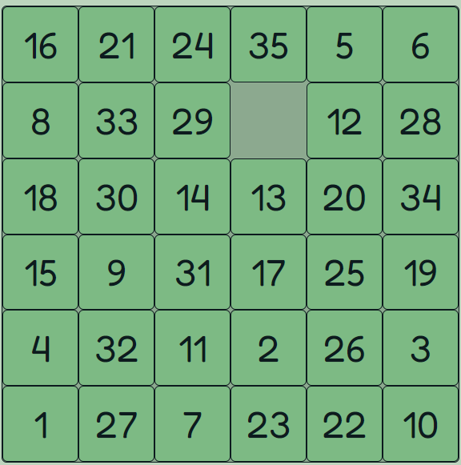 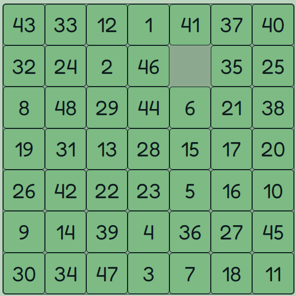 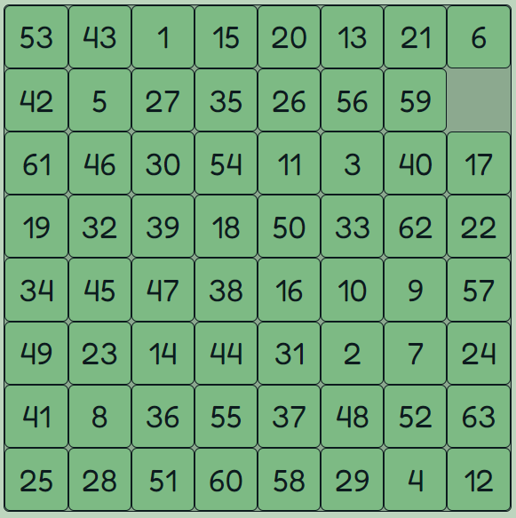 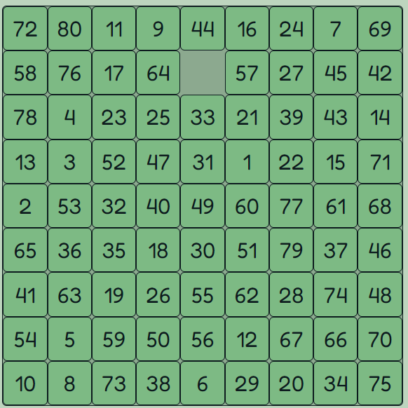|
| Game buttons | Above the puzzle two buttons are available. The new game button opens a pop up and after choosing a puzzle size a new game starts. This can be used to start a new game of a different size without finishing the current game. The reshuffle button reshuffles the puzzle while keeping the same puzzle size. This can be used to reshuffle a game where one does not want to solve the current tile arrangement. Both buttons reset the timer and move counter. |  |
| Game buttons for desktop devices | On desktop devices the game buttons are presented on the left side of the puzzle. |  |
| Game statistics | Below the puzzle a number of information about the game is presented. First there is a move counter that counts how many tiles have been moved, secondly there is a timer that records how long a user takes to solve the puzzle. Both these numbers will be saved in local storage and possibly displayed on the leaderboard. Lastly, the current puzzle grid size is displayed. |  |
| Game statistics for desktop devices | On desktop devices the game statistics are presented on the right side of the puzzle. |  |
| Landing pop up | Upon loading the page the landing pop up is shown. This pop up briefly explains the purpose of this site and the game and then asks the user to input a player name, this is required for the leaderboard to be functional and if a player name is available in local storage this name is preloaded. The user can then select a puzzle size (number of tiles) and thus a difficulty level for the game. Once they click play a game of the selected size starts and the move counter and the timer start running. Behind the pop up a default grid is visible for consistent design. This pop up can only be closed by filling in the data and clicking play (see above) or by pressing escape, in this case the default grid is shown and the user can start a game by pressing the new game button. The pop up was implemented using dialog modals. |  |
| New game pop up | Clicking the new game button opens the new game pop up. This pop up includes a form where the user can select the puzzle size of the game they want to start, after clicking play a new game of the selected size starts and the move counter and timer restart fresh. The pop up can also be closed by pressing the close button, clicking anywhere outside the modal or pressing escape, in this case the timer continues from were it paused before. The pop up was implemented using dialog modals. |  |
| Win message pop up | When the puzzle is solved (all tiles ordered in ascending order with the empty tile in the bottom right corner), a pop up with a win message opens. The player name is displayed in the message as is the number of moves and the time needed to solve the puzzle. These numbers are also saved in local storage and compared to previous records to possibly be displayed on the leaderboard. The user then has the option to start a new game by choosing the puzzle size and pressing play. The puzzle size of the just won puzzle is preselected. If the user closes the pop up by clicking the close button, clicking anywhere outside the modal or pressing escape, the solved puzzle is displayed but no more tiles can be moved and the timer is paused. The user can then start a new game by clicking the new game or reshuffle buttons. The pop up was implemented using dialog modals. |  |
| Leaderboard pop up | When clicking the star icon in the header a leaderboard shows up presenting a list of played puzzle sizes with the least moves needed to solve the puzzle, as well as the best time in which the puzzle was solved, both including the player name. Note that this data is taken from the local storage, so only data is visible for puzzle sizes which have been played and are still saved in local storage. This is mostly for the player to be able to see their own scores and improve them. When the pop up is open, the timer pauses and restarts again when the modal is closed (through clicking the close button, clicking anywhere outside the modal or pressing escape). The pop up was implemented using dialog modals. |  |
| Rules pop up |  When clicking the information icon in the header, a pop up with more information on the game opens.
It contains a description of the game, instructions on how to solve it and information on the controls. When the pop up is open, the timer pauses and restarts again when the modal is closed (through clicking the close button, clicking anywhere outside the modal or pressing escape). The pop up was implemented using dialog modals. |  |
| Landscape mode warning for mobile devices | When the game is played on a mobile device with a screen width less than 680px, the game can only be played in portrait mode, since in landscape mode the height is just not enough to display the puzzle grid properly. This is handled by detecting when a mobile device is in landscape mode with javascript, and when this happens, the timer pauses and a modal is displayed asking the user to rotate the device. Once the device is rotated to portrait mode, the modal closes and the timer resumes. The breakpoint was chosen by looking at many different screen sizes in Chrom Dev Tools and checking the most common screen resolutions on [BrowserStack](https://www.browserstack.com/guide/common-screen-resolutions). |  |
| Error 404 page | The custom error 404 page displays a puzzle grid in the same design as the game page only instead of numbers it contains an error message guiding the user back to the game and providing a link to the home page. |  |

### Future Features

- For now, the game is controlled by clicking on the tiles (or touching on mobile devices) and if a tile is next to the empty tile it is moved. This provides good functionality and as a future feature it would be a good idea to also allow
    - Keyboard control for desktop devices (e.g. move the empty tile with arrow keys)
    - Drag and drop tiles on mobile devices (e.g. using jQuery drag and drop)
Both these options would improve user experience through offering more ways to move the tiles.

- Another very useful future feature would be to implement the option to automatically move several tiles in one go. This would make the game much faster and more user friendly, since it would require significantly fewer clicks to solve the puzzle. If one clicks on a tile in the same row or column as the empty tile (but not neighbouring the empty tile), all tiles up to the empty tile are moved.

- It would also be nice to implement the option for the user to  upload their own images to display on the puzzle, so users can play personalised sliding puzzles.

- For now, the leaderboard data only uses local storage, thus users can only beat there own previous records. It would be great to also include a "real" leaderboard by including a database with backend developemnt.

## Tools & Technologies Used

-  used to generate README and TESTING templates.
-  used for version control. (`git add`, `git commit`, `git push`)
-  used for secure online code storage.
-  used as a cloud-based IDE for development.
-  used for the main site content.
-  used for the main site design and layout.
-  used for user interaction on the site as well as the game logic.
-  used for hosting the deployed front-end site.
-  used for creating wireframes.
-  used for the icons.
-  used to generate favicon for the website.

## Testing

> [!NOTE]  
> For all testing, please refer to the [TESTING.md](TESTING.md) file.

## Deployment

The site was deployed to GitHub Pages. The steps to deploy are as follows:

- In the [GitHub repository](https://github.com/theresaabl/sliding-puzzle), navigate to the Settings tab 
- From the source section drop-down menu, select the **Main** Branch, then click "Save".
- The page will be automatically refreshed with a detailed ribbon display to indicate the successful deployment.

The live link can be found [here](https://theresaabl.github.io/sliding-puzzle)

### Local Deployment

This project can be cloned or forked in order to make a local copy on your own system.

#### Cloning

You can clone the repository by following these steps:

1. Go to the [GitHub repository](https://github.com/theresaabl/sliding-puzzle) 
2. Locate the Code button above the list of files and click it 
3. Select if you prefer to clone using HTTPS, SSH, or GitHub CLI and click the copy button to copy the URL to your clipboard
4. Open Git Bash or Terminal
5. Change the current working directory to the one where you want the cloned directory
6. In your IDE Terminal, type the following command to clone my repository:
	- `git clone https://github.com/theresaabl/sliding-puzzle.git`
7. Press Enter to create your local clone.

Alternatively, if using Gitpod, you can click below to create your own workspace using this repository.

Please note that in order to directly open the project in Gitpod, you need to have the browser extension installed.
A tutorial on how to do that can be found [here](https://www.gitpod.io/docs/configure/user-settings/browser-extension).

#### Forking

By forking the GitHub Repository, we make a copy of the original repository on our GitHub account to view and/or make changes without affecting the original owner's repository.
You can fork this repository by using the following steps:

1. Log in to GitHub and locate the [GitHub Repository](https://github.com/theresaabl/sliding-puzzle)
2. At the top of the Repository (not top of page) just above the "Settings" Button on the menu, locate the "Fork" Button.
3. Once clicked, you should now have a copy of the original repository in your own GitHub account!

### Local VS Deployment

There are no known differences between the local version in Gitpod and the live deployment site on GitHub Pages.

## Credits

### Content

| Source | Location | Notes |
| --- | --- | --- |
| [Markdown Builder](https://tim.2bn.dev/markdown-builder) | README and TESTING | tool to help generate the Markdown files |
| [W3Schools](https://www.w3schools.com/CSS/css_grid.asp) | puzzle tile grid | CSS grid layout |
| [Medium](https://hojelse.medium.com/make-a-truly-responsive-square-in-css-d917f5ef286d) | puzzle tile grid | make a responsive square in CSS |
| [FreeCodeCamp](https://www.freecodecamp.org/news/how-to-shuffle-an-array-of-items-using-javascript-or-typescript/) | script.js | Fisher-Yates algorithm to randomly shuffle an array (the puzzle tiles) |
| [GeeksForGeeks](https://www.geeksforgeeks.org/check-instance-15-puzzle-solvable/) | puzzle tile grid | check whether the randomly shuffled puzzle is solvable |
| [GeeksForGeeks](https://www.geeksforgeeks.org/how-to-center-an-element-using-positionfixed-in-css/) | dialogs in entire page | center element in center of page using position fixed |
| [Web Dev Simplified Blog](https://blog.webdevsimplified.com/2023-04/html-dialog/) | entire page | create and control dialog modals |
| [Dev](https://dev.to/walternascimentobarroso/creating-a-timer-with-javascript-8b7) | game score area and leaderboard | create and control a timer with javascript | 
| [Stackoverflow](https://stackoverflow.com/a/2679208) | game score area, leaderboard and other dialogs | check whether a timer is running |
| [Youtube](https://www.youtube.com/watch?v=YL1F4dCUlLc&t=857s) | leaderboard and landing and win dialogs | use local storage with javascript |
| [Dev](https://dev.to/dcodeyt/the-easiest-way-to-detect-device-orientation-in-javascript-7d7) | entire page for mobile | check orientation of a device |

### Media

| Source | Location | Type | Notes |
| --- | --- | --- | --- |
| [Twemoji](https://github.com/twitter/twemoji/blob/master/assets/svg/1f9e9.svg) | entire page | image | favicon on all pages |

### Acknowledgements

I would like to thank my Code Institute mentor, [Tim Nelson](https://github.com/TravelTimN) for his advice and support throughout the development of this project. I would also like to thank my husband for his valuable insight and feedback.