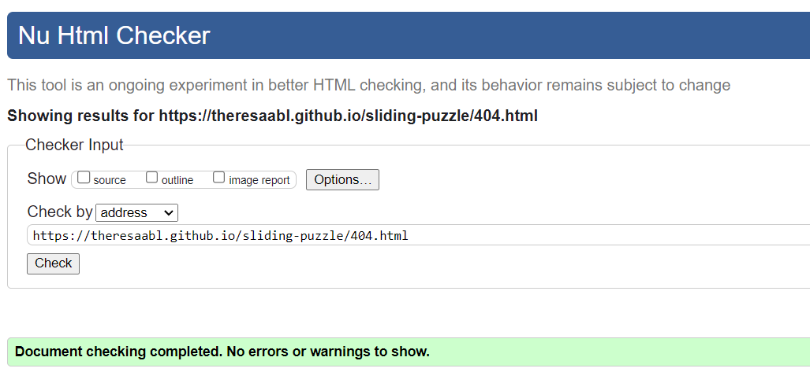
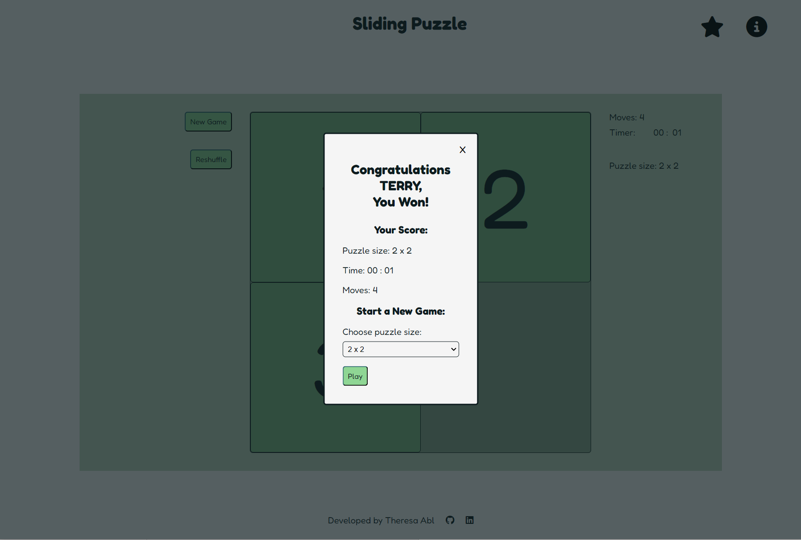

# Testing

> [!NOTE]  
> Return back to the [README.md](README.md) file.

## Code Validation

### HTML

I have used the recommended [HTML W3C Validator](https://validator.w3.org) to validate all of my HTML files.

| Directory | File | Screenshot | Notes |
| --- | --- | --- | --- |
|  | [index.html](https://theresaabl.github.io/sliding-puzzle/index.html) |  | On first validation there was a number of errors, which were easily fixed.  |
|  | [404.html](https://theresaabl.github.io/sliding-puzzle/404.html) |  | Upon first validation there was an error which was easily fixed.  |

### CSS

I have used the recommended [CSS Jigsaw Validator](https://jigsaw.w3.org/css-validator) to validate my CSS file.

| Directory | File | Screenshot | Notes |
| --- | --- | --- | --- |
| assets/css | [style.css](https://jigsaw.w3.org/css-validator/validator?uri=https://theresaabl.github.io/sliding-puzzle) |  | |

### JavaScript

I have used the recommended [JShint Validator](https://jshint.com) to validate all of my JS files.

| Directory | File | Screenshot | Notes |
| --- | --- | --- | --- |
| assets/js | script.js |  | On first validation there was a number of minor errors, which were easily fixed.  |
| assets/js | script-404.js |  | |

## Browser Compatibility

I have tested my deployed project on multiple browsers to check for compatibility issues. The browsers I have tested on are:
- [Chrome](https://www.google.com/chrome)
- [Firefox](https://www.mozilla.org/firefox)
- [Edge](https://www.microsoft.com/edge)

| Browser | Landing modal | Main game | Win message | New game modal | Leaderboard | Rules | 404 page | Notes |
| --- | --- | --- | --- | --- | --- | --- | --- | -- |
| Chrome |  |  | |  |  |   |  |  Works as expected |
| Firefox |  |  | |  |  |   |  |  There is a bug showing up in Firefox: When clicking on the select elements in the new game or win modals, the modal closes immediately without letting the user select an option. The select element can however be accessed via keyboard. This issue comes from the function that handles when a user clicks outside the modal. In other browsers clicking outside the modal closes it, but nothing happens when clicking inside it. However in Firefox, clicking on a select element returns  e.clientX and e.clientY of 0, which leads to the modal closing. See also e.g. [Stackoverflow](https://stackoverflow.com/questions/77402658/why-does-clicking-a-select-dropdown-inside-a-form-embedded-in-a-modal-dialog-clo). A quick solution would be to leave this functionality out as the user can also close the modal by clicking the close button and pressing the escape key. However, for the purpose of this release I decided to leave this functionality in, and Firefox users can control the select elements via keyboard. |
| Edge |  |  | |  |  |   |  |  Works as expected |

## Responsiveness

I have tested my deployed project on multiple devices to check for responsiveness issues. I first tested many different device sizes in Chrome DevTools and then tested the site on different physical devices. The screenshots below are from the real devices.

| Device | Landing modal | Main game | Win message | New game modal | Leaderboard | Rules | 404 page | Notes |
| --- | --- | --- | --- | --- | --- | --- | --- | --- |
| Samsung Galaxy A41 (Mobile) |  |  |  |  |  |  |  | Works as expected |
| Galaxy Tab S6 Lite (Tablet) |  |  |  |  |  |  |  | Works as expected |
| Lenovo X1 Extreme (Laptop) |  |  |  |  |  |  |  | Works as expected |
| Lenovo ThinkVision P24h-10 (Monitor) |  |  |  |  |  |  |  | Works as expected |

## Lighthouse Audit

I have tested my deployed project using the Lighthouse Audit tool to check for any major issues.

| Page | Mobile | Desktop | Notes |
| --- | --- | --- | --- |
| Main page |  |  | Some minor warnings |
| error 404 page |  |  | Some minor warnings |

## Defensive Programming

🛑🛑🛑🛑🛑🛑🛑🛑🛑🛑-START OF NOTES (to be deleted)

Defensive programming (defensive design) is extremely important!

When building projects that accept user inputs or forms, you should always test the level of security for each.
Examples of this could include (not limited to):

Forms:
- Users cannot submit an empty form
- Users must enter valid email addresses

PP3 (Python-only):
- Users must enter a valid letter/word/string when prompted
- Users must choose from a specific list only

MS3 (Flask) | MS4/PP4/PP5 (Django):
- Users cannot brute-force a URL to navigate to a restricted page
- Users cannot perform CRUD functionality while logged-out
- User-A should not be able to manipulate data belonging to User-B, or vice versa
- Non-Authenticated users should not be able to access pages that require authentication
- Standard users should not be able to access pages intended for superusers

You'll want to test all functionality on your application, whether it's a standard form,
or uses CRUD functionality for data manipulation on a database.
Make sure to include the `required` attribute on any form-fields that should be mandatory.
Try to access various pages on your site as different user types (User-A, User-B, guest user, admin, superuser).

You should include any manual tests performed, and the expected results/outcome.

Testing should be replicable.
Ideally, tests cases should focus on each individual section of every page on the website.
Each test case should be specific, objective, and step-wise replicable.

Instead of adding a general overview saying that everything works fine,
consider documenting tests on each element of the page
(ie. button clicks, input box validation, navigation links, etc.) by testing them in their happy flow,
and also the bad/exception flow, mentioning the expected and observed results,
and drawing a parallel between them where applicable.

Consider using the following format for manual test cases:

Expected Outcome / Test Performed / Result Received / Fixes Implemented

- **Expected**: "Feature is expected to do X when the user does Y."
- **Testing**: "Tested the feature by doing Y."
- (either) **Result**: "The feature behaved as expected, and it did Y."
- (or) **Result**: "The feature did not respond to A, B, or C."
- **Fix**: "I did Z to the code because something was missing."

Use the table below as a basic start, and expand on it using the logic above.

🛑🛑🛑🛑🛑🛑🛑🛑🛑🛑-END OF NOTES (to be deleted)

Defensive programming was manually tested with the below user acceptance testing:

| Page | Expectation | Test | Result | Fix | Screenshot |
| --- | --- | --- | --- | --- | --- |
| Home | | | | | |
| | Feature is expected to do X when the user does Y | Tested the feature by doing Y | The feature behaved as expected, and it did Y | Test concluded and passed |  |
| | Feature is expected to do X when the user does Y | Tested the feature by doing Y | The feature did not respond to A, B, or C. | I did Z to the code because something was missing |  |
| About | | | | | |
| | Feature is expected to do X when the user does Y | Tested the feature by doing Y | The feature behaved as expected, and it did Y | Test concluded and passed |  |
| | Feature is expected to do X when the user does Y | Tested the feature by doing Y | The feature did not respond to A, B, or C. | I did Z to the code because something was missing |  |
| Gallery | | | | | |
| | Feature is expected to do X when the user does Y | Tested the feature by doing Y | The feature behaved as expected, and it did Y | Test concluded and passed |  |
| | Feature is expected to do X when the user does Y | Tested the feature by doing Y | The feature did not respond to A, B, or C. | I did Z to the code because something was missing |  |
| Contact | | | | | |
| | Feature is expected to do X when the user does Y | Tested the feature by doing Y | The feature behaved as expected, and it did Y | Test concluded and passed |  |
| | Feature is expected to do X when the user does Y | Tested the feature by doing Y | The feature did not respond to A, B, or C. | I did Z to the code because something was missing |  |
| repeat for all remaining pages | x | x | x | x | x |

🛑🛑🛑🛑🛑🛑🛑🛑🛑🛑-START OF NOTES (to be deleted)

Another way of performing defensive testing is a simple Pass/Fail for each test.
The assessors prefer the above method, with the full test explained, but this is also acceptable in most cases.

When in doubt, use the above method instead, and delete the table below.

🛑🛑🛑🛑🛑🛑🛑🛑🛑🛑-END OF NOTES (to be deleted)

| Page | User Action | Expected Result | Pass/Fail | Comments |
| --- | --- | --- | --- | --- |
| Home | | | | |
| | Click on Logo | Redirection to Home page | Pass | |
| | Click on Home link in navbar | Redirection to Home page | Pass | |
| Gallery | | | | |
| | Click on Gallery link in navbar | Redirection to Gallery page | Pass | |
| | Load gallery images | All images load as expected | Pass | |
| Contact | | | | |
| | Click on Contact link in navbar | Redirection to Contact page | Pass | |
| | Enter first/last name | Field will accept freeform text | Pass | |
| | Enter valid email address | Field will only accept email address format | Pass | |
| | Enter message in textarea | Field will accept freeform text | Pass | |
| | Click the Submit button | Redirects user to form-dump | Pass | User must click 'Back' button to return |
| Sign Up | | | | |
| | Click on Sign Up button | Redirection to Sign Up page | Pass | |
| | Enter valid email address | Field will only accept email address format | Pass | |
| | Enter valid password (twice) | Field will only accept password format | Pass | |
| | Click on Sign Up button | Asks user to confirm email page | Pass | Email sent to user |
| | Confirm email | Redirects user to blank Sign In page | Pass | |
| Log In | | | | |
| | Click on the Login link | Redirection to Login page | Pass | |
| | Enter valid email address | Field will only accept email address format | Pass | |
| | Enter valid password | Field will only accept password format | Pass | |
| | Click Login button | Redirects user to home page | Pass | |
| Log Out | | | | |
| | Click Logout button | Redirects user to logout page | Pass | Confirms logout first |
| | Click Confirm Logout button | Redirects user to home page | Pass | |
| Profile | | | | |
| | Click on Profile button | User will be redirected to the Profile page | Pass | |
| | Click on the Edit button | User will be redirected to the edit profile page | Pass | |
| | Click on the My Orders link | User will be redirected to the My Orders page | Pass | |
| | Brute forcing the URL to get to another user's profile | User should be given an error | Pass | Redirects user back to own profile |
| repeat for all remaining pages | x | x | x | x |

## User Story Testing

| User Story | Screenshot |
| --- | --- |
| As a user, I would like to play a sliding puzzle game that is functional and easy to control. |  |
| As a user, I would like to choose the puzzle size I play on. |    |
| As a user, I would like to be able to reshuffle the puzzle at any time. |  |
| As a user, I would like to be able to start a new game at any time. |   |
| As a user, I would like to see when I won the game and start a new one right away. |  |
| As a user, I would like to have access to information about the game and the controls. |  |
| As a user, I would like to see my score and have access to a leaderboard. |  |

## Bugs

I have tracked my bugs with **GitHub Issues** :

### Fixed Bugs

All previously closed/fixed bugs can be tracked [here](https://github.com/theresaabl/pp-seminars/issues?q=is%3Aissue+is%3Aclosed).

| Bug | Status |
| --- | --- |
| [Event listeners don't work after tiles have been moved](https://github.com/theresaabl/sliding-puzzle/issues/1) | Closed |
| [randomShuffle creates duplicate tiles](https://github.com/theresaabl/sliding-puzzle/issues/2) | Closed |
| [Uncaught ReferenceError: gridSize is not defined](https://github.com/theresaabl/sliding-puzzle/issues/3) | Closed |
| [Grid columns width changes when moving tiles](https://github.com/theresaabl/sliding-puzzle/issues/4) | Closed |
| [Puzzle not always checked for solvability](https://github.com/theresaabl/sliding-puzzle/issues/5) | Closed |
| [Timer start when new game modal is closed](https://github.com/theresaabl/sliding-puzzle/issues/6) | Closed |
| [Puzzle sometimes still ordered after shuffle](hhttps://github.com/theresaabl/sliding-puzzle/issues/7) | Closed |
| [Timer continues after game ended in some cases](https://github.com/theresaabl/sliding-puzzle/issues/8) | Closed |
| [Puzzle size 5 still sometimes not solvable](https://github.com/theresaabl/sliding-puzzle/issues/9) | Closed |

### Open Issues

Any remaining open issues can be tracked [here](https://github.com/theresaabl/sliding-puzzle/issues).

See also the [Browser compatability](#browser-compatibility) section.
