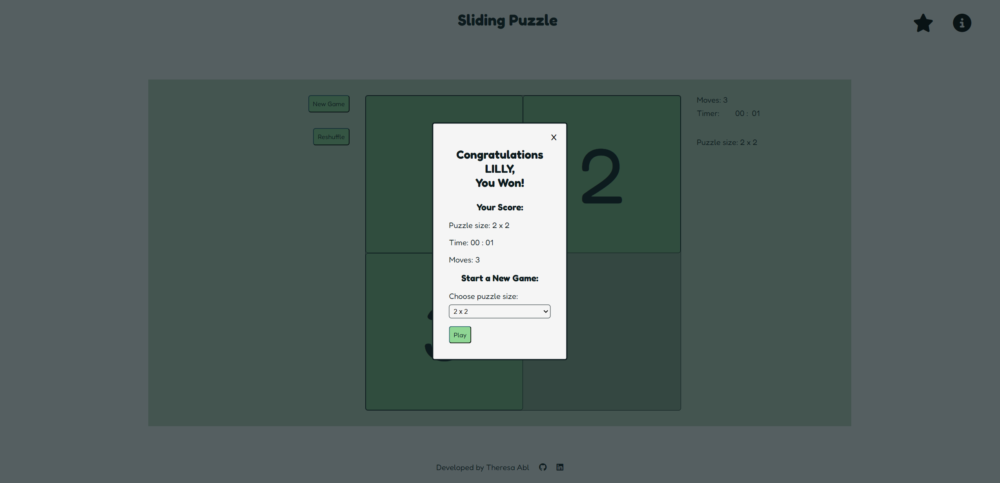
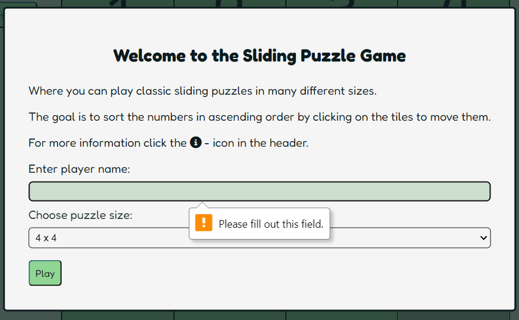

# Testing

> [!NOTE]  
> Return back to the [README.md](README.md) file.

## Code Validation

### HTML

I have used the recommended [HTML W3C Validator](https://validator.w3.org) to validate all of my HTML files.

| Directory | File | Screenshot | Notes |
| --- | --- | --- | --- |
|  | [index.html](https://validator.w3.org/nu/?doc=https://theresaabl.github.io/sliding-puzzle/index.html) |  | On first validation there was a number of errors, which were easily fixed.  |
|  | [404.html](https://validator.w3.org/nu/?doc=https://theresaabl.github.io/sliding-puzzle/404.html) |  | On first validation there was an error which was easily fixed.  |

### CSS

I have used the recommended [CSS Jigsaw Validator](https://jigsaw.w3.org/css-validator) to validate my CSS file.

| Directory | File | Screenshot | Notes |
| --- | --- | --- | --- |
| assets/css | [style.css](https://jigsaw.w3.org/css-validator/validator?uri=https://theresaabl.github.io/sliding-puzzle) |  | |

### JavaScript

I have used the recommended [JShint Validator](https://jshint.com) to validate all of my JS files.

| Directory | File | Screenshot | Notes |
| --- | --- | --- | --- |
| assets/js | script.js |  | On first validation there was a number of minor errors, which were easily fixed.  |
| assets/js | script-404.js |  | |

## Browser Compatibility

I have tested my deployed project on multiple browsers to check for compatibility issues. The browsers I have tested on are:
- [Chrome](https://www.google.com/chrome)
- [Firefox](https://www.mozilla.org/firefox)
- [Edge](https://www.microsoft.com/edge)

| Browser | Landing modal | Main game | Win message | New game modal | Leaderboard | Rules | 404 page | Notes |
| --- | --- | --- | --- | --- | --- | --- | --- | -- |
| Chrome |  |  | |  |  |   |  |  Works as expected |
| Firefox |  |  | |  |  |   |  | See below |
| Edge |  |  | |  |  |   |  |  Works as expected |

There is a bug showing up in Firefox (see [open Issue](https://github.com/theresaabl/sliding-puzzle/issues?q=is%3Aopen+is%3Aissue)): When clicking on the select elements in the new game or win modals, the modal closes immediately without letting the user select an option. The select element can however be accessed via keyboard. This issue comes from the function that handles when a user clicks outside the modal. In other browsers clicking outside the modal closes it, but nothing happens when clicking inside it. However in Firefox, clicking on a select element returns  e.clientX and e.clientY of 0, which leads to the modal closing. See also e.g. [Stackoverflow](https://stackoverflow.com/questions/77402658/why-does-clicking-a-select-dropdown-inside-a-form-embedded-in-a-modal-dialog-clo). A quick solution would be to leave this functionality out as the user can also close the modal by clicking the close button and pressing the escape key. However, for the purpose of this release I decided to leave this functionality in, and Firefox users can control the select elements via keyboard.

## Responsiveness

I have tested my deployed project on multiple devices to check for responsiveness issues. I first tested many different device sizes in Chrome DevTools and then tested the site on different physical devices. The screenshots below are from the real devices.

| Device | Landing modal | Main game | Win message | New game modal | Leaderboard | Rules | Landscape warning | 404 page | Notes |
| --- | --- | --- | --- | --- | --- | --- | --- | --- | --- |
| Samsung Galaxy A41 (Mobile) |  |  |  |  |  |  |  |  | Works as expected |
| Galaxy Tab S6 Lite (Tablet) |  |  |  |  |  |  |  |  | Works as expected |
| Lenovo X1 Extreme (Laptop) |  |  |  |  |  |  | |   | Works as expected |
| Lenovo ThinkVision P24h-10 (Monitor) |  |  |  |  |  |  | |  | Works as expected |

## Lighthouse Audit

I have tested my deployed project using the Lighthouse Audit tool to check for any major issues.

| Page | Mobile | Desktop | Notes |
| --- | --- | --- | --- |
| Main page |  |  | Some minor warnings |
| Error 404 page |  |  | Some minor warnings |

## Defensive Programming

Defensive programming was manually tested with the below user acceptance testing:

| Feature | Expectation | Action | Outcome | Fix | Screenshot |
| --- | --- | --- | --- | --- | --- |
| **Landing pop up** | When the page is loaded the landing modal will open | Load the page | Landing modal opened when page loaded | Test concluded and passed |  |
|  | When a player name is entered and play is clicked after choosing a puzzle size a new game of the chosen size will start | Click play after entering player name and selecting puzzle size | New game started after play clicked | Test concluded and passed |  |
|  | When no player name is entered and play is clicked a warning to enter a player name is shown and the form cannot be submitted | Click play without entering a player name | A warning showed after clicking play without entering a player name | Test concluded and passed |  |
|  | When the modal is closed by pressing the "Escape" key, a default grid is shown and a game can be started by pressing one of the game buttons | Close the modal by pressing "Escape" | A default puzzle grid was displayed after modal closed | Test concluded and passed |  |
| **Logo** |  When clicked the home page will open | Click the logo | Home page opened when clicked | Test concluded and passed |  |
| **Header icons** | When clicked the leaderboard or rules modal will open respectively | Click the star icon or the information icon | Leaderboard or rules modal opened when clicked | Test concluded and passed |  |
|  | When clicked the timer will pause | Click the star icon or the information icon | Timer paused when clicked | Test concluded and passed |   |
| **Leaderboard pop up** | When modal opens the leaderboard is displayed with data from local storage | Click the star icon | Leaderboard was displayed when modal opened | Test concluded and passed. Note that only scores from previously played puzzle sizes are displayed on the leaderboard, so it will be empty in the beginning. |  |
| | When clicking the close button the modal will close | Click close button | Modal closed when clicked | Test concluded and passed |  |
| | When clicking anywhere outside the modal it will close | Click outside the modal | Modal closed when clicked outside | Note that this works well in Chrome and Edge and leads to a bug in Firefox, see [Open Issues](#open-issues) |  |
| | When pressing the "Escape" key the modal will close | Press "Escape" key | Modal closed when pressed | Test concluded and passed |  |
| | When closing the modal the timer will resume and game will continue | Close the modal | Timer resumed and game was continued | Test concluded and passed |  |
| **Rules pop up** | When clicking the close button the modal will close | Click close button | Modal closed when clicked | Test concluded and passed |   |
| | When clicking anywhere outside the modal it will close | Click outside the modal | Modal closed when clicked outside | Note that this works well in Chrome and Edge and leads to a bug in Firefox, see [Open Issues](#open-issues) |  |
| | When pressing the "Escape" key the modal will close | Press "Escape" key | Modal closed when pressed | Test concluded and passed |  |
| | When closing the modal the timer will resume and game will continue | Close the modal | Timer resumed and game was continued | Test concluded and passed |  |
| **Sliding puzzle game** | When a tile is clicked, the tile will move if it is next to the empty tile | Click a tile next to the empty tile | A tile next to the empty tile moves when clicked | Test concluded and passed |  |
| | When a tile is clicked, the tile will not move if it is not next to the empty tile | Click a tile not next to the empty tile | A tile not next to the empty tile does not move when clicked | Test concluded and passed |  |
| **Win message pop up** | When all tiles are ordered in the correct way and the puzzle is solved, the win modal shows | Solve the puzzle | A win message shows when the puzzle is solved | Test concluded and passed |  |
| | When win  modal opens the timer stops | Solve the puzzle | Timer stopped when opened (solved puzzle) | Test concluded and passed |  |
| | When clicking the close button the modal will close | Click close button | Modal closed when clicked | Test concluded and passed |  |
| | When clicking anywhere outside the modal it will close | Click outside the modal | Modal closed when clicked outside | Note that this works well in Chrome and Edge and leads to a bug in Firefox, see [Open Issues](#open-issues) |  |
| | When pressing the "Escape" key the modal will close | Press "Escape" key | Modal closed when pressed | Test concluded and passed |  |
| | When closing the modal the timer stays stopped and no tiles can be moved | Close the modal | Timer stays stopped and no tiles can be moved after win modal closed | There was a bug where when opening the leaderboard or rules modals after the game was won and closing them again, the timer started again even though the game was finished. See Issue [Timer will continue after game ended in some cases](https://github.com/theresaabl/sliding-puzzle/issues/8) for the fix. |  |
| **Win message form**  | The previously won puzzle size is preselected  in the form select element | Win a puzzle of a given size | The won puzzle size is preselected in the form select element | Test concluded and passed |  |
| | When a puzzle size is selected and the Play button is pressed a new game of the selected size starts | Select a puzzle size and click the play button | A new game of selected size starts when Play is clicked | Test concluded and passed |  |
| **New Game button** | When clicked the new game modal will open | Click the New Game button | New game modal opened when clicked | Test concluded and passed |  |
| **New game pop up** | When the modal opens the timer will pause | Click the New Game button | Timer will pause when opened | Test concluded and passed |  |
| | When clicking the close button the modal will close | Click close button | Modal closed when clicked | Test concluded and passed |  |
| | When clicking anywhere outside the modal it will close | Click outside the modal | Modal closed when clicked outside | Note that this works well in Chrome and Edge and leads to a bug in Firefox, see [Open Issues](#open-issues) |  |
| | When pressing the "Escape" key the modal will close | Press "Escape" key | Modal closed when pressed | Test concluded and passed |  |
| | When closing the modal the timer will resume and game will continue | Close the modal without starting a new puzzle | Timer resumed and game was continued | Test concluded and passed |  |
| **New game form** | When a puzzle size is selected and the Play button is clicked a new game of the selected size starts | Select a puzzle size and click the Play button | A new game of selected size starts when Play is clicked | Test concluded and passed |  |
| **Reshuffle button** | When clicked the puzzle will reshuffle randomly | Click the Reshuffle button | Puzzle reshuffled when clicked | Test concluded and passed |  |
| **Game statistics** | When a tile is moved the move counter is incremented by one | Move a tile | Moves incremented by one when tile moved | Test concluded and passed |  |
|  | When new game starts timer and moves are reset | Start a new game through any of the options | Timer and Moves are reset when new game starts | Test concluded and passed |  |
| **Timer** | When playing the game a timer will run | Start game | Timer ran when game starts | Test concluded and passed |  |
|  | When opening any modal the timer will pause | Open modal | Timer paused when modal open | Test concluded and passed |  |
|  | When closing a modal without starting a new game the timer will resume | Close modal | Timer resumed when modal closed | Test concluded and passed |  |
| **Footer** | When social media icons are clicked the respective page will open in a new tab | Click icons | Social media page opened in new tab when clicked | Test concluded and passed |  |
| **Landscape mode warning for mobile devices** | When rotating mobile device to landscape mode the landscape warning modal will show | Rotate mobile device to landscape mode | Landscape warning modal showed when device rotated to landscape mode | Test concluded and passed |  |
| | When the modal is open the timer will pause | Rotate mobile device to landscape mode | Timer paused when modal opened | Test concluded and passed |  |
| | Without rotating the mobile device the modal cannot be closed  | Click outside the modal | Modal does not close when clicking outside without rotating device | Test concluded and passed |  |
| | When rotating device to portrait mode the modal will close and the timer will resume  | Rotate to portrait mode | Modal closed and timer resumed when rotated back | Test concluded and passed |  |
| **Error 404 page** | When entering a URL that does not exist on this page an error 404 page will open | Enter a wrong URL on this page | Error page opened when wrong URL was entered | Test concluded and passed |  |
|  | When clicking on any of the links in header or main the home page will open | Click on any of the links in header or main | Home page opened when links clicked | Test concluded and passed |  |

## User Story Testing

| User Story | Screenshot |
| --- | --- |
| As a user, I would like to play a sliding puzzle game that is functional and easy to control. |  |
| As a user, I would like to choose the puzzle size I play on. |    |
| As a user, I would like to be able to reshuffle the puzzle at any time. |  |
| As a user, I would like to be able to start a new game at any time. |   |
| As a user, I would like to see when I won the game and start a new one right away. |  |
| As a user, I would like to have access to information about the game and the controls. |  |
| As a user, I would like to see my score and have access to a leaderboard. |  |

## Bugs

I have tracked my bugs with **GitHub Issues** :

### Fixed Bugs

All previously closed/fixed bugs can be tracked [here](https://github.com/theresaabl/pp-seminars/issues?q=is%3Aissue+is%3Aclosed).

| Bug | Status |
| --- | --- |
| [Event listeners don't work after tiles have been moved](https://github.com/theresaabl/sliding-puzzle/issues/1) | Closed |
| [randomShuffle creates duplicate tiles](https://github.com/theresaabl/sliding-puzzle/issues/2) | Closed |
| [Uncaught ReferenceError: gridSize is not defined](https://github.com/theresaabl/sliding-puzzle/issues/3) | Closed |
| [Grid columns width changes when moving tiles](https://github.com/theresaabl/sliding-puzzle/issues/4) | Closed |
| [Puzzle not always checked for solvability](https://github.com/theresaabl/sliding-puzzle/issues/5) | Closed |
| [Timer start when new game modal is closed](https://github.com/theresaabl/sliding-puzzle/issues/6) | Closed |
| [Puzzle sometimes still ordered after shuffle](https://github.com/theresaabl/sliding-puzzle/issues/7) | Closed |
| [Timer continues after game ended in some cases](https://github.com/theresaabl/sliding-puzzle/issues/8) | Closed |
| [Puzzle size 5 still sometimes not solvable](https://github.com/theresaabl/sliding-puzzle/issues/9) | Closed |

### Open Issues

Any remaining open issues can be tracked [here](https://github.com/theresaabl/sliding-puzzle/issues).

See also the [Browser compatability](#browser-compatibility) section.
